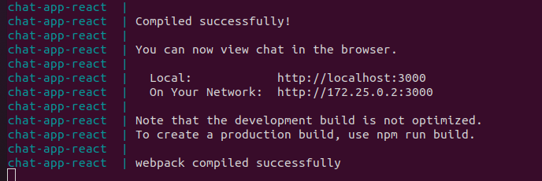

# Simple React Chat-app 

Simple React Chat-app for education purpose.

## Description

Chat-app based on React + Firebase + Docker

## Getting Started

### Dependencies

* Docker Engine version 27.1.2 or higher
* firebase account
* gmail account

### Installing

* clone repo to your local machine
* set firebase config to src/firebase-config.js
* on project root run command via console
```
docker compose up --force-recreate --build
```
* after compilation console will show links to view chat in the browser


## Help

Inspiration, code snippets, etc.
* [medium](https://joshuapleduc.medium.com/firebase-and-react-firebase-hooks-authentication-firestore-and-the-simplicity-of-it-all-5251a91656c3)
* [chat design](https://www.bootdey.com/snippets/view/card-chat-list)
